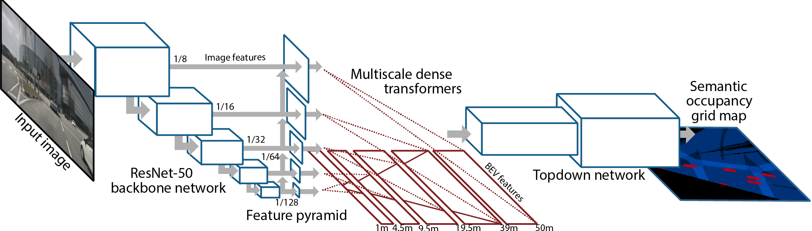

# Predicting Semantic Map Representations from Images with Pyramid Occupancy Networks

This is the code associated with the paper [Predicting Semantic Map Representations from Images with Pyramid Occupancy Networks](https://arxiv.org/pdf/2003.13402.pdf), published at CVPR 2020.



## Data generation
In our work we report results on two large-scale autonomous driving datasets: NuScenes and Argoverse. The birds-eye-view ground truth labels we use to train and evaluate our networks are generated by combining map information provided by the two datasets with 3D bounding box annotations, which we rasterise to produce a set of one-hot binary labels. We also make use of LiDAR point clouds to infer regions of the birds-eye-view which are completely occluded by buildings or other objects.

### NuScenes
To train our method on NuScenes you will first need to
1. Download the NuScenes dataset which can be found at https://www.nuscenes.org/download. Only the metadata, keyframe and lidar blobs are necessary. 
2. Download the map expansion pack. Note that to replicate our original results you should use the original version of the expansion (v1.0). The later versions fixed some bugs with the original maps so we would expect even better performance!
3. Install the NuScenes devkit from https://github.com/nutonomy/nuscenes-devkit
4. Cd to `mono-semantic-maps`
5. Edit the `configs/datasets/nuscenes.yml` file, setting the `dataroot` and `label_root` entries to the location of the NuScenes dataset and the desired ground truth folder respectively.
6. Run our data generation script: `python scripts/make_nuscenes_labels.py`. Bewarned there's a lot of data so this will take a few hours to run! 

### Argoverse
To train on the Argoverse dataset:
1. Download the Argoverse tracking data from https://www.argoverse.org/data.html#tracking-link. Our models were trained on version 1.1, you will need to download the four training blobs, validation blob, and the HD map data.
2. Install the Argoverse devkit from https://github.com/argoai/argoverse-api
3. Cd to `mono-semantic-maps`
5. Edit the `configs/datasets/argoverse.yml` file, setting the `dataroot` and `label_root` entries to the location of the install Argoverse data and the desired ground truth folder respectively.
5. Run our data generation script: `python scripts/make_argoverse_labels.py`. This script will also take a while to run! 


## Training
Once ground truth labels have been generated, you can train our method by running the `train.py` script in the root directory: 
```
python train.py --dataset nuscenes --model pyramid
```
The `--dataset` flag allows you to specify the dataset to train on, either `'argoverse'` or `'nuscenes'`. The model flag allows training of the proposed method `'pyramid'`, or one of the baseline methods (`'vpn'` or `'ved'`). Additional command line options can be specified by passing a list of key-value pairs to the `--options` flag. The full list of configurable options can be found in the `configs/defaults.yml` file. 

